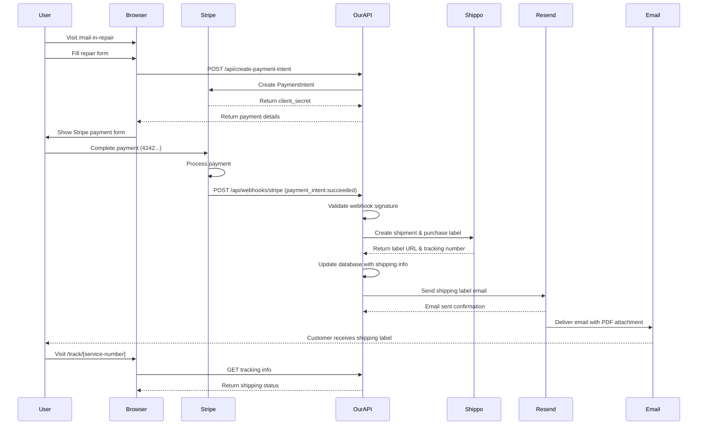

# Dash Fixes Mail-in Repair Workflow

## Complete Payment & Shipping Process



## Webhook Processing Steps (Detailed)

When Stripe sends `payment_intent.succeeded` webhook:

### 1. **Webhook Validation**
- ✅ Verify Stripe signature
- ✅ Parse payment intent data
- ✅ Extract service request ID

### 2. **Shippo Integration**
- ✅ Detect test mode (`shippo_test_*`)
- ✅ Create shipment with customer address
- ✅ Get shipping rates
- ✅ **TEST MODE**: Simulate transaction (no real purchase)
- ✅ **PROD MODE**: Actually purchase carrier label

### 3. **Database Update**
- ✅ Mark payment as `paid`
- ✅ Store tracking number
- ✅ Store label URL
- ✅ Set shipping provider & cost

### 4. **Email Delivery**
- ✅ Generate/fetch PDF
- ✅ Send via Resend API
- ✅ Include tracking info
- ✅ Attach shipping label PDF

## Debugging Checklist (After Webhook Trigger)

### **Immediate Checks (0-30 seconds):**

1. **Stripe Dashboard**
   - ✅ Webhook delivery status: `succeeded`
   - ✅ Event: `payment_intent.succeeded`
   - ✅ Webhook endpoint: `https://www.dashfixes.com/api/webhooks/stripe`

2. **Resend Dashboard**
   - ✅ Email sent to customer
   - ✅ Subject: "Your Dash Fixes Shipping Label"
   - ✅ Attachment: PDF file present

### **If Webhook Fails:**

3. **Cloudflare Pages Logs**
   - Check function logs for errors
   - Look for Shippo API failures
   - Check for PDF generation issues

4. **Shippo Dashboard (Production Only)**
   - ✅ New transaction created
   - ✅ Label purchased
   - ✅ Tracking number generated

### **Test Mode Specific:**

- **Shippo**: No dashboard entries (test mode)
- **Tracking**: Uses simulated numbers like `1Z9999999999US`
- **Labels**: Custom PDF (not real carrier label)

## Quick Test Commands

```bash
# Check if site is up
curl -I https://www.dashfixes.com

# Test webhook endpoint (requires Stripe CLI)
stripe listen --forward-to https://www.dashfixes.com/api/webhooks/stripe

# Check email delivery
# Visit Resend dashboard: https://resend.com/emails
```

## Expected Results

**✅ Success Indicators:**
- Email arrives within 30 seconds
- PDF attachment is valid and printable
- Tracking page shows shipping info
- No errors in Stripe webhook logs

**❌ Failure Indicators:**
- No email received
- Webhook shows "failed" status
- Error logs in Cloudflare functions
- Customer sees error page

## Test Flow

1. **Trigger**: Complete payment on site
2. **Check**: Stripe webhook delivery (immediate)
3. **Check**: Resend email sent (0-30s)
4. **Check**: Customer email inbox (0-60s)
5. **Verify**: PDF opens and contains shipping info</content>
</xai:function_call">Workflow documentation created